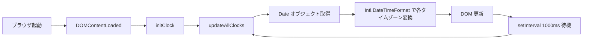
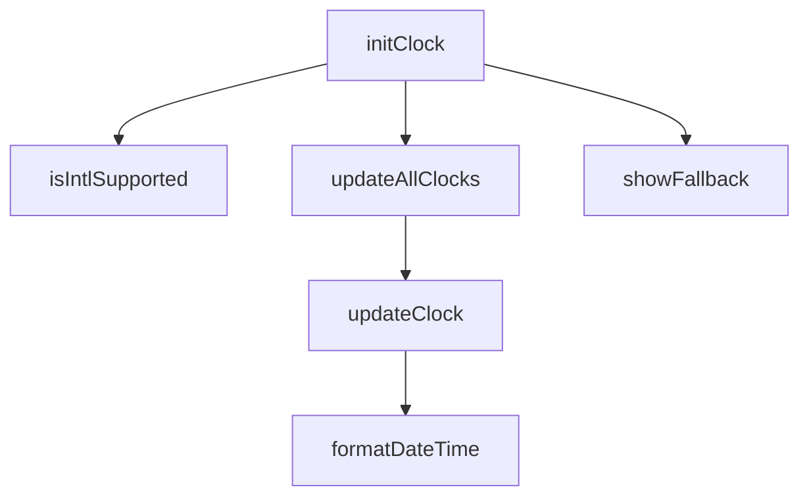

# Design Document: world-clock

## Overview

世界時計（World Clock）は、世界の主要10都市の現在時刻をリアルタイムで表示する静的Webページです。バックエンドや外部APIを一切使用せず、JavaScriptの標準API（`Date` オブジェクト・`Intl.DateTimeFormat`）のみで動作します。GitHub Pages 上のポートフォリオサイト（`docs/works/world-clock/`）に配置され、単独の3ファイル（`index.html` / `style.css` / `clock.js`）として実装されます。

### 目標

- 10都市の現在時刻を1秒ごとに自動更新して表示する
- ダークテーマ・モノスペースフォントによるデジタル時計デザインを提供する
- スマートフォン（320px）からデスクトップ（1280px+）まで対応するレスポンシブレイアウトを実現する
- WCAG 2.1 AA 基準のアクセシビリティを満たす
- 外部依存なしで `file://` プロトコルを含むあらゆる配信方式で動作する

---

## Architecture

### 構成概要

```
docs/works/world-clock/
├── index.html   ── ページ構造・ARIA属性・Clock_Cardのマークアップ
├── style.css    ── ダークテーマ・レスポンシブレイアウト・デジタル時計スタイル
└── clock.js     ── Display_Engineロジック（時刻算出・DOM更新・タイマー管理）
```

### データフロー



### 責務分担

| ファイル | 責務 |
|---|---|
| `index.html` | セマンティックなHTML構造、ARIA属性、Clock_Cardテンプレート |
| `style.css` | ダークテーマ配色、グリッドレイアウト、レスポンシブ対応、アニメーション |
| `clock.js` | IANA タイムゾーンデータ定義、時刻算出、DOM更新、エラーハンドリング |

---

## Components and Interfaces

### 1. HTML構造

#### ページレイアウト

```html
<html lang="ja">
  <head> ... </head>
  <body>
    <header>
      <h1>World Clock</h1>
    </header>
    <main id="clock-grid">
      <!-- Clock_Card × 10 -->
      <article class="clock-card" aria-label="{都市名} 現在時刻 {時刻}">
        <header class="card-header">
          <span class="city-name">{都市名}</span>
          <span class="country-name">{国名}</span>
        </header>
        <div class="time-display"
             role="timer"
             aria-live="polite"
             aria-atomic="true">
          <span class="time-value">--:--:--</span>
        </div>
        <div class="date-display">
          <span class="date-value">----/--/--</span>
        </div>
      </article>
    </main>
    <footer> ... </footer>
    <!-- フォールバック通知 -->
    <div id="tz-warning" role="alert" hidden>
      タイムゾーン非対応のブラウザです
    </div>
  </body>
</html>
```

### 2. clock.js — Display Engine

#### 都市データ定義

```js
const CITIES = [
  { id: 'tokyo',        city: '東京',          country: '日本',       timezone: 'Asia/Tokyo' },
  { id: 'new-york',     city: 'ニューヨーク',   country: 'アメリカ',   timezone: 'America/New_York' },
  { id: 'london',       city: 'ロンドン',       country: 'イギリス',   timezone: 'Europe/London' },
  { id: 'paris',        city: 'パリ',           country: 'フランス',   timezone: 'Europe/Paris' },
  { id: 'dubai',        city: 'ドバイ',         country: 'UAE',        timezone: 'Asia/Dubai' },
  { id: 'singapore',    city: 'シンガポール',   country: 'シンガポール', timezone: 'Asia/Singapore' },
  { id: 'sydney',       city: 'シドニー',       country: 'オーストラリア', timezone: 'Australia/Sydney' },
  { id: 'los-angeles',  city: 'ロサンゼルス',   country: 'アメリカ',   timezone: 'America/Los_Angeles' },
  { id: 'sao-paulo',    city: 'サンパウロ',     country: 'ブラジル',   timezone: 'America/Sao_Paulo' },
  { id: 'mumbai',       city: 'ムンバイ',       country: 'インド',     timezone: 'Asia/Kolkata' },
];
```

#### 主要関数

```js
/**
 * ページ初期化
 * DOMContentLoaded 後に一度だけ呼ばれる
 */
function initClock(): void

/**
 * Intl.DateTimeFormat APIサポートチェック
 * @returns {boolean} サポートされているか
 */
function isIntlSupported(): boolean

/**
 * 全Clock_Cardの時刻を更新
 * setInterval から1秒ごとに呼ばれる
 */
function updateAllClocks(): void

/**
 * 単一都市の時刻を算出してDOMに反映
 * @param {CityConfig} city - 都市設定オブジェクト
 * @param {Date} now        - 現在のDateオブジェクト
 */
function updateClock(city: CityConfig, now: Date): void

/**
 * Intl.DateTimeFormat で時刻文字列を生成
 * @param {Date} date      - 対象Date
 * @param {string} timezone - IANA タイムゾーン識別子
 * @returns {{ time: string, date: string }} HH:MM:SS と YYYY-MM-DD
 */
function formatDateTime(date: Date, timezone: string): { time: string, date: string }

/**
 * フォールバック処理（Intl非対応ブラウザ）
 * UTC時刻を表示し警告メッセージを表示する
 */
function showFallback(): void
```

#### 関数シグネチャの依存関係



### 3. style.css — スタイル構成

#### CSS変数（カスタムプロパティ）

```css
:root {
  /* ダークテーマ基本色 */
  --color-bg:          #0d0d0d;   /* ページ背景 */
  --color-surface:     #1a1a1a;   /* カード背景 */
  --color-surface-alt: #222222;   /* カードヘッダー */
  --color-border:      #333333;   /* ボーダー */

  /* テキスト色 */
  --color-text-primary:   #e0e0e0; /* 主テキスト（コントラスト比 12:1以上） */
  --color-text-secondary: #a0a0a0; /* 副テキスト（コントラスト比 5:1以上） */
  --color-accent:         #00ff88; /* 時刻表示アクセント（コントラスト比 10:1以上） */

  /* フォント */
  --font-mono:   'Courier New', Courier, monospace;
  --font-sans:   system-ui, sans-serif;

  /* サイズ */
  --font-time:   clamp(2rem, 4vw, 3rem);  /* 時刻（最小2rem保証） */
  --font-date:   clamp(0.85rem, 1.5vw, 1rem);
  --font-city:   clamp(1rem, 2vw, 1.25rem);
  --radius:      8px;
  --gap:         1rem;
}
```

#### レスポンシブグリッドレイアウト

```css
#clock-grid {
  display: grid;
  grid-template-columns: repeat(auto-fill, minmax(280px, 1fr));
  gap: var(--gap);
  padding: 1rem;
}

/* 320px〜: 1列（minmax指定により自動） */
/* 640px〜: 2列 */
/* 960px〜: 3列 */
/* 1280px〜: 4〜5列 */
```

---

## Data Models

### CityConfig（都市設定オブジェクト）

```ts
interface CityConfig {
  id:       string;  // DOM ID生成用スラッグ（例: "tokyo"）
  city:     string;  // 都市名（日本語、例: "東京"）
  country:  string;  // 国名（日本語、例: "日本"）
  timezone: string;  // IANA タイムゾーン識別子（例: "Asia/Tokyo"）
}
```

### FormattedTime（フォーマット済み時刻）

```ts
interface FormattedTime {
  time: string;  // "HH:MM:SS" 形式（例: "09:30:45"）
  date: string;  // "YYYY-MM-DD" 形式（例: "2025-07-20"）
}
```

### IANA タイムゾーン対応表

| 都市 | 国 | IANA タイムゾーン | UTC オフセット（標準時）|
|---|---|---|---|
| 東京 | 日本 | `Asia/Tokyo` | +09:00 |
| ニューヨーク | アメリカ | `America/New_York` | -05:00 / -04:00（DST） |
| ロンドン | イギリス | `Europe/London` | +00:00 / +01:00（BST） |
| パリ | フランス | `Europe/Paris` | +01:00 / +02:00（CEST） |
| ドバイ | UAE | `Asia/Dubai` | +04:00 |
| シンガポール | シンガポール | `Asia/Singapore` | +08:00 |
| シドニー | オーストラリア | `Australia/Sydney` | +10:00 / +11:00（AEDT） |
| ロサンゼルス | アメリカ | `America/Los_Angeles` | -08:00 / -07:00（PDT） |
| サンパウロ | ブラジル | `America/Sao_Paulo` | -03:00 / -02:00（BRST） |
| ムンバイ | インド | `Asia/Kolkata` | +05:30 |

> **設計決定**: DSTの処理は `Intl.DateTimeFormat` に完全に委譲する。JavaScriptエンジンがブラウザのOSタイムゾーンデータベースを使用するため、DST切り替えは自動で正確に処理される。


---

## Correctness Properties

*プロパティとは、システムの全ての有効な実行において真であるべき特性または振る舞いのことです。形式的にシステムが何をすべきかを述べたステートメントであり、人間が読める仕様と機械が検証可能な正確性保証の橋渡しをします。*

本フィーチャーでは `formatDateTime`（時刻フォーマット変換）と DOM更新ロジック（`aria-label` 設定）に純粋な関数ロジックが存在するため、プロパティベーステストが適用可能です。UIレンダリング・CSS確認・タイマー設定等は SMOKE/EXAMPLE テストで対応します。

### プレワーク分析と冗長性除去の結果

**統合:** 要件1.2（有効な時刻文字列の算出）と 1.3（HH:MM:SS / YYYY-MM-DD フォーマット）は共に `formatDateTime` 関数を対象とし、1.3がより具体的なフォーマット検証を含むため1つのプロパティに統合。

**独立:** 要件5.1（`aria-label` の内容）と 5.4（コントラスト比）は互いに無関係な関心事のため、それぞれ独立したプロパティとして保持。

---

### Property 1: 時刻フォーマットの正確性

*For any* 有効な `Date` オブジェクトと任意の IANA タイムゾーン識別子を `formatDateTime` に渡したとき、返される `time` は `HH:MM:SS` 形式（時・分・秒がそれぞれ2桁ゼロ埋め）であり、`date` は `YYYY-MM-DD` 形式（年4桁・月2桁・日2桁ゼロ埋め）である。

**Validates: Requirements 1.2, 1.3**

---

### Property 2: aria-label には都市名と時刻が含まれる

*For any* `CityConfig`（都市名・タイムゾーンを持つ任意の都市設定）と `FormattedTime`（`HH:MM:SS` 形式の任意の時刻文字列）の組み合わせに対して `updateClock` を呼び出したとき、対応する Clock_Card 要素の `aria-label` 属性には都市名と時刻文字列の両方が含まれている。

**Validates: Requirements 5.1**

---

### Property 3: WCAG AA コントラスト比の保証

*For any* 設計で定義されたテキストと背景の色の組み合わせ（`--color-text-primary` / `--color-bg`、`--color-accent` / `--color-surface`、`--color-text-secondary` / `--color-surface` 等）において、WCAG 2.1 の相対輝度計算式に基づいて算出したコントラスト比が 4.5:1 以上である。

**Validates: Requirements 5.4**

---

## Error Handling

### Intl.DateTimeFormat 非対応ブラウザ

```
IF typeof Intl === 'undefined' OR typeof Intl.DateTimeFormat === 'undefined'
  THEN showFallback()
    → 全Clock_Cardの時刻表示をUTC時刻で更新
    → id="tz-warning" の警告メッセージを表示（hidden 属性を除去）
    → aria-live="assertive" で警告をスクリーンリーダーに通知
```

**設計決定:** 非対応ブラウザでもページが壊れないよう、UTC時刻でのグレースフルデグラデーションを採用する。

### IANA タイムゾーン識別子のサポートエラー

```
IF Intl.DateTimeFormat が特定のタイムゾーン識別子をサポートしない
  THEN formatDateTime は try/catch でエラーをキャッチ
    → UTC フォールバックで時刻表示
    → コンソールに警告ログ出力（ユーザー向けUIには影響しない）
```

### setInterval のエラー

```
setInterval のコールバック内で発生する全エラーは try/catch でラップし、
個別のClock_Card更新の失敗が他のカードに影響しないように分離する。
```

---

## Testing Strategy

### デュアルテスト戦略

本フィーチャーはUIレンダリング中心だが、純粋な関数ロジック部分にはプロパティベーステスト（PBT）を適用し、それ以外はユニットテスト・SMOKEテストで対応する。

### プロパティベーステスト（PBT）

**使用ライブラリ:** [fast-check](https://fast-check.io/)（JavaScript/TypeScript向け PBT ライブラリ）

**対象関数:** `formatDateTime`、`updateClock`（`aria-label`更新部分）、コントラスト比計算関数

**設定:** 各プロパティテストは最低100イテレーション実行する。

#### PBT 実装方針

```js
// Property 1: 時刻フォーマットの正確性
// Feature: world-clock, Property 1: 時刻フォーマットの正確性
fc.assert(fc.property(
  fc.date(),  // 任意のDateオブジェクト
  fc.constantFrom(...CITIES.map(c => c.timezone)),  // 任意のIANAタイムゾーン
  (date, timezone) => {
    const result = formatDateTime(date, timezone);
    return /^\d{2}:\d{2}:\d{2}$/.test(result.time)
        && /^\d{4}-\d{2}-\d{2}$/.test(result.date);
  }
), { numRuns: 100 });

// Property 2: aria-label には都市名と時刻が含まれる
// Feature: world-clock, Property 2: aria-label には都市名と時刻が含まれる
fc.assert(fc.property(
  fc.constantFrom(...CITIES),  // 任意の都市設定
  fc.string().filter(s => /^\d{2}:\d{2}:\d{2}$/.test(s)),  // 有効な時刻文字列
  (city, timeStr) => {
    updateClock(city, { time: timeStr, date: '2025-01-01' });
    const card = document.getElementById(city.id);
    const label = card.getAttribute('aria-label');
    return label.includes(city.city) && label.includes(timeStr);
  }
), { numRuns: 100 });

// Property 3: WCAG AA コントラスト比
// Feature: world-clock, Property 3: WCAG AA コントラスト比の保証
// （色の組み合わせは固定値なので fast-check でなく計算関数の単体テストとして実装）
```

### ユニットテスト（Jest / Vitest）

| テスト対象 | テスト種別 | 内容 |
|---|---|---|
| `isIntlSupported()` | EXAMPLE | Intl利用可/不可の各ケース |
| `showFallback()` | EXAMPLE | 警告メッセージ表示とUTC表示の確認 |
| `initClock()` | SMOKE | setIntervalが1000msで呼ばれること |
| 10都市のClock_Cardの存在 | EXAMPLE | DOM上に10要素が生成されること |
| `file://`プロトコル動作 | EXAMPLE | 外部通信なしで時刻が表示されること |

### アクセシビリティテスト

- `role="timer"` と `aria-live="polite"` の属性存在確認（SMOKE）
- `lang="ja"` 属性の確認（SMOKE）
- [axe-core](https://github.com/dequelabs/axe-core) または [Lighthouse](https://developers.google.com/web/tools/lighthouse) による自動アクセシビリティ監査

### 手動テスト

- レスポンシブレイアウト（320px / 768px / 1280px での表示確認）
- スクリーンリーダー（NVDA / VoiceOver）での読み上げ確認
- DST 切り替えタイミングの時刻正確性（夏時間適用都市）
- `file://` プロトコルでのブラウザ直接表示

> **注意:** WCAG準拠の完全な検証には支援技術を使った手動テストとアクセシビリティ専門家によるレビューが必要です。

